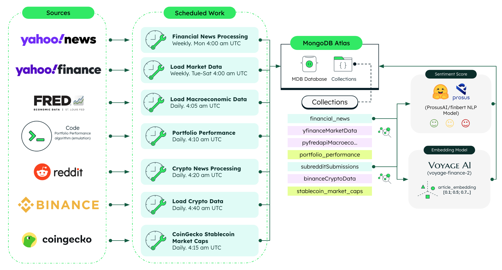

# Capital Markets Loaders Service

This repository hosts the backend for the **Capital Markets Loaders** service. It is designed to handle the extraction, transformation, and loading (ETL) of financial data from various sources, including Yahoo Finance and the Federal Reserve Economic Data (FRED) API, as well as financial news processing.

## High Level Architecture



## What is the Capital Markets Loaders Service?

The Capital Markets Loaders Service is responsible for:

- Extracting market data from Yahoo Finance.
- Extracting macroeconomic data from the FRED API.
- Scraping and processing financial news.
- Generating portfolio performance (emulation).
- Transforming and loading the extracted data into MongoDB for further analysis.

## Where Does MongoDB Shine?

MongoDB stands out as an ideal database solution for this Capital Markets Loaders service due to its exceptional ability to handle diverse data types within a single database platform:

### Handling Diverse Financial Data Types

1. **Market Data (Time Series Collections)**: The service retrieves market data for various asset classes (equities, bonds, real estate, commodities) from Yahoo Finance. MongoDB's [Time Series collections](https://www.mongodb.com/docs/manual/core/timeseries/) are perfectly suited for this data, offering optimized storage, efficient querying, and automatic data expiration for historical market information.

2. **Financial News (Unstructured Data & Vector Search)**: MongoDB excels at storing and querying unstructured data like financial news articles. Additionally, the document model seamlessly accommodates article embeddings generated by the service, enabling powerful [Vector Search capabilities](https://www.mongodb.com/products/platform/atlas-vector-search) for semantic similarity searches and AI-driven insights.

3. **Macroeconomic Indicators**: Data from the FRED API is efficiently stored in standard MongoDB collections, allowing for flexible querying and aggregation of economic indicators that can be correlated with market movements.

4. **Portfolio Performance Data**: The emulated portfolio performance data fits naturally into MongoDB's document model, enabling efficient storage and retrieval of complex investment performance metrics.

This versatility eliminates the need for multiple specialized databases, reducing architectural complexity while providing performance-optimized storage for each data type—a significant advantage for financial applications that process and analyze diverse datasets.

## The 4 Pillars of the Document Model

1. **Easy**: [MongoDB's document model](https://www.mongodb.com/resources/basics/databases/document-databases) naturally fits with object-oriented programming, utilizing BSON documents that closely resemble JSON. This design simplifies the management of complex data structures such as user accounts, allowing developers to build features like account creation, retrieval, and updates with greater ease.

2. **Fast**: Following the principle of "Data that is accessed together should be stored together," MongoDB enhances query performance. This approach ensures that related data—like user and account information—can be quickly retrieved, optimizing the speed of operations such as account look-ups or status checks, which is crucial in services demanding real-time access to operational data.

3. **Flexible**: MongoDB's schema flexibility allows account models to evolve with changing business requirements. This adaptability lets financial services update account structures or add features without expensive and disruptive schema migrations, thus avoiding costly downtime often associated with structural changes.

4. **Versatile**: The document model in MongoDB effectively handles a wide variety of data types, such as strings, numbers, booleans, arrays, objects, and even vectors. This versatility empowers applications to manage diverse account-related data, facilitating comprehensive solutions that integrate user, account, and transactional data seamlessly.

## MongoDB Key Features

- **Time Series** - ([More info](https://www.mongodb.com/products/capabilities/time-series)): For storing market data in a time series format.
- **Atlas Vector Search**  ([More info](https://www.mongodb.com/products/platform/atlas-vector-search)): For enabling vector search on financial news data.

## Tech Stack

- [MongoDB Atlas](https://www.mongodb.com/atlas/database) for the database.
- [FastAPI](https://fastapi.tiangolo.com/) for the backend framework.
- [Poetry](https://python-poetry.org/) for dependency management.
- [Uvicorn](https://www.uvicorn.org/) for ASGI server.
- [Docker](https://www.docker.com/) for containerization.

## Relevant Python Packages

- [yfinance](https://pypi.org/project/yfinance/) for extracting market data from Yahoo Finance.
- [pyfredapi](https://pypi.org/project/pyfredapi/) for extracting macroeconomic data from the FRED API.
- [pandas](https://pandas.pydata.org/) for data manipulation.
- [scheduler](https://pypi.org/project/scheduler/) for job scheduling.
- [transformers](https://huggingface.co/transformers/) for NLP tasks.

## Relevant Models

- [FinBERT](https://huggingface.co/ProsusAI/finbert) for sentiment score calculation.
- [voyage-finance-2](https://blog.voyageai.com/2024/06/03/domain-specific-embeddings-finance-edition-voyage-finance-2/) for generating article embeddings.

### ETL Processes

- **Yahoo Finance Market Data ETL**: Extracts, transforms, and loads market data for various asset types using the `yfinance` Python package.
- **FRED API Macroeconomic Data ETL**: Extracts, transforms, and loads macroeconomic data using the `pyfredapi` Python package.
- **Financial News Processing**: Scrapes financial news, generates embeddings using [`voyage-finance-2`](https://blog.voyageai.com/2024/06/03/domain-specific-embeddings-finance-edition-voyage-finance-2/) model from Voyage AI, and calculates sentiment scores using [FinBERT](https://huggingface.co/ProsusAI/finbert), a pre-trained NLP model to analyze sentiment of financial text.

### News Sentiment Logic (Calculation)

The financial news sentiment analysis follows a sophisticated pipeline to extract meaningful insights from news articles:

1. **Data Ingestion**: The system scrapes financial news articles from Yahoo Search, storing them in the `financial_news` collection in MongoDB. For Phase 1, we use a fixed dataset of approximately 255 articles covering the 10 assets in the portfolio (about 20 articles per asset).

2. **Text Processing**: For each article, we construct a comprehensive `article_string` by concatenating multiple fields:

```bash
Headline: QQQ Leads Inflows as VGIT, HYG Jump: ETF Flows as of Feb. 27
/n Description: Top 10 Creations (All ETFs) Ticker Name Net Flows ($, mm) AUM ($, mm) AUM % Change QQQ Invesco QQQ...
/n Source: etf.com ·  via Yahoo Finance
/n Ticker: HYG
/n Link: https://finance.yahoo.com/news/qqq-leads-inflows-vgit-hyg-005429051.html?fr=sycsrp_catchall
```

3. **Sentiment Analysis**: The `article_string` is processed by [FinBERT](https://huggingface.co/ProsusAI/finbert), a financial-domain-specific language model trained to understand financial text sentiment. This generates a sentiment score for each article.

4. **Data Enrichment**: The sentiment scores are stored back in the `financial_news` collection, associating each article with its computed sentiment.

5. **Vector Embedding Generation**: The same `article_string` is passed to the [voyage-finance-2](https://blog.voyageai.com/2024/06/03/domain-specific-embeddings-finance-edition-voyage-finance-2/) model, generating a 1024-dimensional vector representation (`article_embedding`) that captures the semantic meaning of the article.

6. **Semantic Search Implementation**: Using MongoDB's Vector Search capability, the system can find semantically similar news articles based on these embeddings—identifying both explicit mentions of a ticker symbol and contextually relevant articles that don't directly reference it.

7. **Portfolio Sentiment Calculation**: For each asset in the portfolio, the system calculates an average sentiment score from its related articles, providing a consolidated sentiment indicator that helps assess market perception of that asset.

This approach enables both explicit keyword matching and deeper semantic understanding of financial news, offering more comprehensive insights than traditional text-based searches.

### Scheduler

- **Job Scheduling**: Uses the [`scheduler`](https://digon.io/hyd/project/scheduler/t/master/readme.html) Python package to schedule and manage ETL processes.


## Prerequisites

Before you begin, ensure you have met the following requirements:

- **MongoDB Atlas** account - [Register Here](https://account.mongodb.com/account/register)
- **Python 3.10 or higher**
- **Poetry** (install via [Poetry's official documentation](https://python-poetry.org/docs/#installation))

## Setup Instructions

### Step 1a: Set Up MongoDB Database and Collections

1. Log in to **MongoDB Atlas** and create a database named `agentic_capital_markets`. Ensure the name is reflected in the environment variables.
2. Create the following collections:
   - `financial_news` (for storing financial news data) - You can export some sample data to this collection using `backend/loaders/db/collections/agentic_capital_markets.financial_news.json` file.
   - `pyfredapiMacroeconomicIndicators` (for storing macroeconomic data) - You can export some sample data to this collection using `backend/loaders/db/collections/agentic_capital_markets.pyfredapiMacroeconomicIndicators.json` file.
   - `yfinanceMarketData` (for storing market data) - You can export some sample data to this collection using `backend/loaders/db/collections/agentic_capital_markets.yfinanceMarketData.json` file. Additionally, there are some more backup files in this directory that you can use to populate the collection:  `backend/loaders/backup/*`

> **_Note:_** For creating the time series collection, you can run the following python script located in the `backend/loaders/db/` directory: `mdb_timeseries_coll_creator.py`. Make sure to parametrize the script accordingly.

### Step 1b: Set Up Vector Search Index

1. Create the vector search index for the `financial_news` collection.

> **_Note:_** For creating the vector search index, you can run the following python script located in the `backend/loaders/db/` directory: `mdb_vector_search_idx_creator.py`. Make sure to parametrize the script accordingly.


### Step 2: Add MongoDB User

Follow [MongoDB's guide](https://www.mongodb.com/docs/atlas/security-add-mongodb-users/) to create a user with **readWrite** access to the `agentic_capital_markets` database.

## Configure Environment Variables

Create a `.env` file in the `/backend` directory with the following content:

```bash
MONGODB_URI="your_mongodb_uri"
DATABASE_NAME="agentic_capital_markets"
APP_NAME="your_app_name"
VOYAGE_API_KEY="your_voyage_api_key"
FRED_API_KEY="your_fred_api_key"
PORTFOLIO_PERFORMANCE_COLLECTION = "portfolio_performance"
YFINANCE_TIMESERIES_COLLECTION = "yfinanceMarketData"
PYFREDAPI_COLLECTION = "pyfredapiMacroeconomicIndicators"
NEWS_COLLECTION = "financial_news"
VECTOR_INDEX_NAME = "financial_news_VS_IDX"
VECTOR_FIELD = "article_embedding"
SCRAPE_NUM_ARTICLES = 1
```

## Running the Backend

### Virtual Environment Setup with Poetry

1. Open a terminal in the project root directory.
2. Run the following commands:
   ```bash
   make poetry_start
   make poetry_install
   ```
3. Verify that the `.venv` folder has been generated within the `/backend` directory.

### Start the Backend

To start the backend service, run:

```bash
poetry run uvicorn main:app --host 0.0.0.0 --port 8004
```

> Default port is `8004`, modify the `--port` flag if needed.

## Running with Docker

Run the following command in the root directory:

```bash
make build
```

To remove the container and image:

```bash
make clean
```

## API Documentation

You can access the API documentation by visiting the following URL:

```
http://localhost:<PORT_NUMBER>/docs
```
E.g. `http://localhost:8004/docs`

> **_Note:_** Make sure to replace `<PORT_NUMBER>` with the port number you are using and ensure the backend is running.

## Common errors

- Check that you've created an `.env` file that contains the required environment variables.

## Future tasks

- [ ] Add tests
- [ ] Evaluate SonarQube for code quality
- [ ] Automate the deployment process using GitHub Actions or CodePipeline
